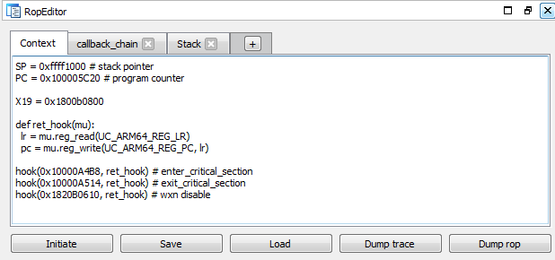
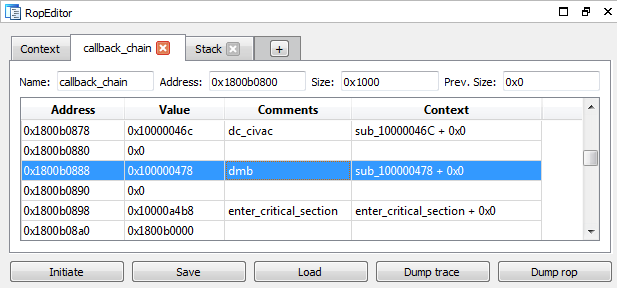

*\* Mascot designed by [@kottsarapkin](https://www.instagram.com/kottsarapkin/)*

**crauEmu** is an [**uEmu**](https://github.com/alexhude/uEmu) extension for developing and analyzing payloads for code-reuse attacks.

* [Slides from ZeroNights 2019](Resources/crau.pdf)
* [Demo 1 - X32-64, Edge, rop-gadgets from pwnjs](Resources/videos/demo01_edge.mp4)
* [Demo 2 - ARM64, checkm8 callback-chain](Resources/videos/demo02_checkm8.mp4)

#### RopEditor

## Installation

1. Put the file **crauEmu.py** in same location as [**uEmu.py**](https://github.com/alexhude/uEmu/blob/master/uEmu.py).
2. Use `File / Script file...` or `ALT+F7` in IDA to load **crauEmu.py**
